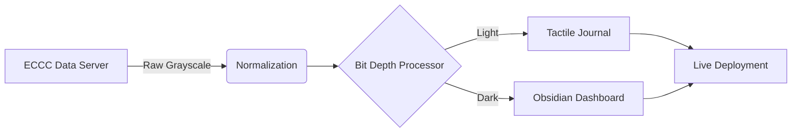

<div align="center">

# 🌌 ATMOLENS
### **Advanced ECCC Synoptic Map Enhancement & Automation**

[](https://vercel.com)
[](https://nextjs.org)
[](https://eccc-msc.github.io/open-data/licence/readme_en/)

**AtmoLens** transforms static, grayscale Environment Canada synoptic charts into high-contrast, color-enhanced meteorological narrations — automatically, every 30 min.

---

## 🌓 The Realities

| **Scrapbook Mode (Light)** | **Obsidian Mode (Dark)** |
| :---: | :---: |
|  |  |
| *Antique White & Paper* | *Deep Obsidian & Glow* |

---

## ⚙️ The Pipeline



---

## ✨ Features
- **🖌️ Auto-Normalization**: OpenCV-driven layer extraction.
- **📔 Storytelling UI**: Unique "Notebook" narrative aesthetic.
- **⚡ Obsidian Engine**: Ultra-low latency weather data rendering.
- **🕵️ QA Dashboard**: Built-in metadata verification.

---

## 🛠️ Tech Stack


---

## 🚀 Quick Start
```bash
git clone https://github.com/thaparSAAB14/AtmoLens.git
cd frontend
npm install
npm run dev
```

---

Built with 🖤 for the meteorological community.
</div>
