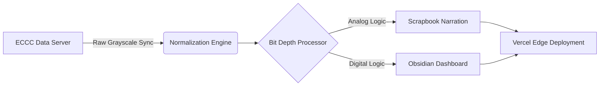

# 🌌 ATMOLENS
### **The Architecture of Meteorological Restoration**

**AtmoLens** is a real-time, automated bridge between paper-era meteorology and the high-fidelity digital future.

---

## 👁️ The Vision
AtmoLens was born from a singular obsession: the restoration of depth to atmospheric analysis. Traditional synoptic charts from **Environment and Climate Change Canada (ECCC)** are reliable but visually flat. Our mission is to breathe life into these records, not just as pixels, but as interactive narratives.

AtmoLens is the lens through which raw atmospheric data becomes cinematic narrative — restoring the human connection to the sky.

---

## 🎨 Philosophy: "Bit Depth"
We believe every data-point tells a story. The **Bit Depth** design system is our solution to the "Digital Coldness" of modern GIS. It splits the user experience into two distinct realities:

### **Scrapbook Reality (Analog)**
The **Light Mode** aesthetic is a tactile, "Antique White" journal. It represents the historical, human effort of weather logging. Featuring semi-transparent jagged tape, handcrafted paper textures, and skeuomorphic binding, it transforms analysis into a personal logbook entry.

### **Obsidian Reality (Digital)**
The **Dark Mode** aesthetic is a deep, nocturnal data-stream. It represents the high-frequency, high-contrast clarity required for professional forecasting. Featuring "Cyan-Obsidian" glow effects and nautical clarity, it provides a focused lens for critical meteorological extraction.

---

## ⚙️ Infrastructure & Pipeline
AtmoLens operates as a distributed, automated normalization engine.

### **1. Automated Normalization**
Every 30 minutes, our backend syncs with ECCC servers to ingest raw synoptic charts. Using real-time OpenCV-driven normalization, we extract meteorological layers from grayscale static images, preparing them for the Bit Depth display engine.

### **2. Storytelling UI**
Our Next.js frontend utilizes **Framer Motion** and **Tailwind CSS** to render a high-fidelity "Notebook" experience. Every interaction is designed to feel physical — from the tilt of a scrapbook card to the curl of a paper corner.

### **3. Production Integrity**
Deployed on the Vercel Edge network, AtmoLens utilizes integrated **Analytics** and **Speed Insights** to monitor global delivery performance, ensuring that weather narratives remain clear and accessible under any load.

---

## 🚀 Technical Directives

### **Deployment**
1. Clone the repository and navigate to the root directory.
2. Initialize the frontend: `cd frontend && npm install`.
3. Launch the development engine: `npm run dev`.

### **Contribution**
AtmoLens is built with **TypeScript**, **Next.js 15**, and **React 19**. We strictly adhere to the "Bit Depth" design system — maintaining a high-contrast, editorial aesthetic across all analytical surfaces.

---

Built with 🖤 for the meteorological community.

