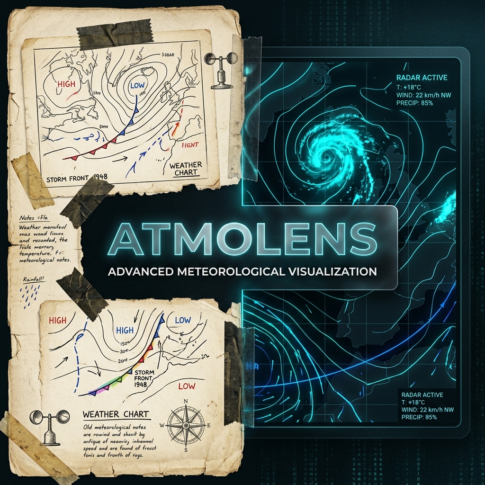
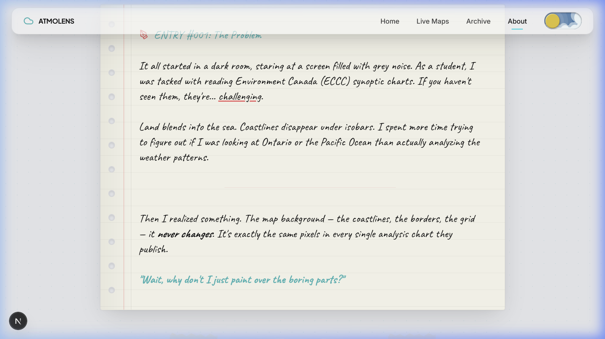
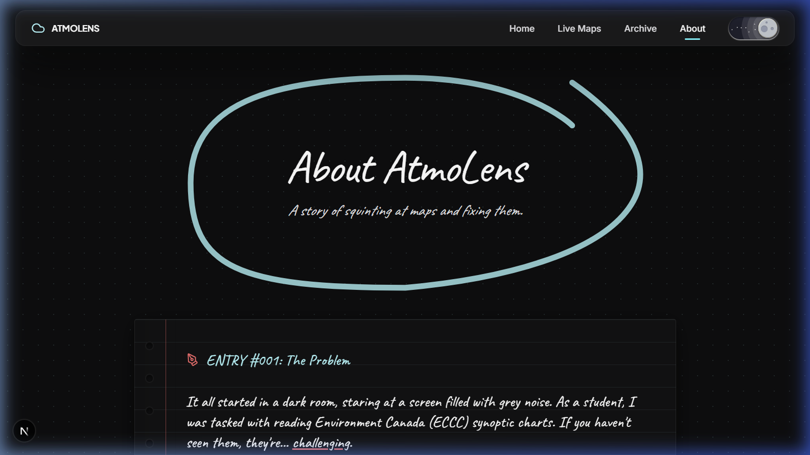
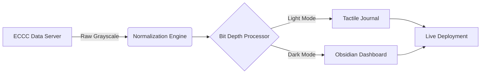

<div align="center">



# 🌌 ATMOLENS
### **Advanced ECCC Synoptic Map Enhancement & Automation**

[](https://vercel.com)
[](https://nextjs.org)
[](https://eccc-msc.github.io/open-data/licence/readme_en/)

**AtmoLens** transforms static, grayscale Environment Canada synoptic charts into high-contrast, color-enhanced meteorological narrations — automatically, every 30 minutes.

[Explore the Docs](#-the-dna) • [Installation](#-getting-started) • [Architecture](#-the-pipeline)

</div>

---

## 🎨 The DNA: "Bit Depth"
AtmoLens is defined by its **Bit Depth** aesthetic — a fusion of tactile, analog "Scrapbook" journaling and deep, nocturnal "Atmospheric Obsidian" interfaces.

<div align="center">

### 🌓 The Two Realities

| **Scrapbook Mode (Light)** | **Obsidian Mode (Dark)** |
| :---: | :---: |
|  |  |
| *Antique White (#fdfbf0), Jagged Tape, Hardened Zinc-900.* | *Deep Obsidian (#121213), Cyan Glow, Hardened Zinc-200.* |

</div>

---

## ⚙️ The Pipeline
How AtmoLens bridges the gap between raw data and visual clarity.



---

## ✨ Key Features
- **🖌️ Automated Normalization**: Real-time OpenCV-driven extraction of meteorological layers.
- **📔 Storytelling UI**: A unique "Notebook" narrative with skeuomorphic binding and realistic depth.
- **⚡ Obsidian Performance**: Optimized for ultra-low latency weather data retrieval.
- **🕵️ Data Guardian**: Built-in QA/QC dashboard for metadata verification.

---

## 🛠️ Tech Stack
<div align="center">


</div>

---

## 🚀 Getting Started

### Installation
1. Clone the repository:
   ```bash
   git clone https://github.com/thaparSAAB14/AtmoLens.git
   ```
2. Install dependencies:
   ```bash
   npm install
   ```
3. Run the development server:
   ```bash
   npm run dev
   ```

### Production Monitoring
Equipped with **Vercel Analytics** and **Speed Insights** for real-time performance tracking and deployment health.

---

<div align="center">
Built with 🖤 for the meteorological community.
</div>
